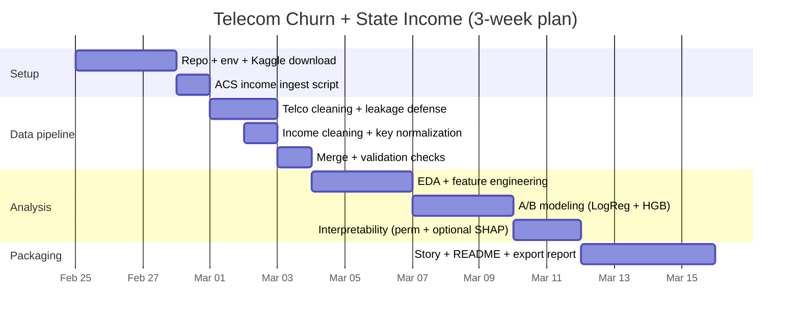

# Product-Style Data Integration + ML Project Plan: Telecom Churn + State Income

## Executive summary

This project simulates a realistic **Product Data Scientist / Applied ML** workflow: you start with “internal” customer churn data from a telecom company, discover that internal features alone may miss important context, then **integrate external socioeconomic data (state income)** to improve both prediction and product-facing insights. The core deliverable is an **A/B modeling comparison**: (A) churn model without external income vs (B) churn model with income features, plus a clean, reproducible repo suitable for applications and interviews. citeturn4search5turn1view3turn6view3

Key outcomes you will produce in 3 weeks:
- A reproducible repo with **raw → processed data pipeline**, feature engineering, modeling, evaluation, and interpretability outputs.
- A clear “product story”: **which segments churn**, **why**, and **what to do about it**, including geo-socioeconomic context.
- A practical demonstration of real-world data work: **key normalization**, **merge validation**, **leakage prevention**, **metric selection**, and **interpretability** (permutation importances and optional SHAP).

Primary sources for this project:
- Internal data: entity["company","Kaggle","data science platform"] dataset “Telecommunications Industry Customer churn dataset” (aadityabansalcodes), described as a telco churn dataset with geographic fields such as Zip Code and related location columns; it is an IBM-style telco churn dataset variant. citeturn0search0turn4search5turn13search4
- External data: entity["organization","HDPulse","nimhd data portal"] income tables (exportable to CSV; graphs exportable to PNG), or fully reproducible income via entity["organization","United States Census Bureau","federal statistical agency"] ACS API. citeturn6view3turn1view3turn12search14

---

## Project framing and datasets

### Project description and business question

**Product-style business question (precise):**  
> “Which customers are at highest risk of churn, what are the biggest product/plan drivers, and does adding *external state income context* improve our ability to rank churn risk and explain churn differences across segments?”

This framing matters because it mirrors how product analytics is used in industry:
- **Prediction** supports targeted retention: prioritize outreach or offers for highest-risk customers.
- **Explainability** supports decision-making: identify levers (contract type, payment method, service bundle, price sensitivity) and contextual factors (regional income).  
- **A/B feature comparison** answers a real applied question: *Is external data worth the integration cost?*

### Internal dataset (telecom churn) — primary choice

**Primary dataset:** “Telecommunications Industry Customer churn dataset” (aadityabansalcodes) on Kaggle. citeturn0search0turn13search1turn13search4

Notes you must treat as **unspecified until download**:
- Exact filenames inside the Kaggle download (Kaggle indicates multiple files; the dataset page snippet suggests multiple formats and multiple files). citeturn13search4  
- Exact churn label column name (often `"Churn"`), and exact state column name (often `"State"`)—you will confirm via step-by-step data profiling.

**Critical leakage warning (important pitfall):**  
Some telco churn variants include columns like **“Churn reason”** and **“Churn category”** that only contain information for churned users; using them can leak the label. citeturn4search8  
Your pipeline will explicitly detect and drop likely leakage columns.

### External dataset (state income) — primary and alternatives

You will implement **two external data options**:

**Option 1 (HDPulse, manual export):**  
HDPulse allows exporting table data to **CSV** via an “Export Data” link and downloading graphs/maps as **PNG** via a “Save Graph” button. citeturn6view3  
You’ll use a national/state income table like “Income table for US by State” (JS-heavy portal; manual export recommended). citeturn0search1turn6view3  
Also review HDPulse restrictions/user agreement before using/exporting. citeturn6view4

**Option 2 (Census ACS API, fully reproducible and recommended):**  
Use the Census ACS 5-year API to pull **median household income** by state using variable **B19013_001E**. The variable definition is available via Census API metadata. citeturn1view3turn12search14  
ACS 5-year estimates are available for states and many other geographies; this is a standard way to access socioeconomic context. citeturn1view3

**Recommendation:** Use **ACS API** as your default (reproducible + scriptable), and optionally include an appendix noting you *can* export from HDPulse for a “real portal” touch. citeturn6view3turn1view3

### Dataset alternatives (if the Kaggle file lacks “State”)

Sometimes telco churn datasets do not include state/zip. If your downloaded file does not include a workable location key:
- Pick another Kaggle telco churn dataset that includes a state-like key (you will verify after download).
- Or reduce integration level: do only internal churn (not recommended for this project’s purpose).
- Or upgrade integration: if you have Zip Code, consider joining to ZCTA-level ACS data later (a 4–5 week extension). ACS supports ZCTA geographies. citeturn1view3

---

## Repository structure and tech stack

### Repo structure (detailed, “interview-ready”)

Use this structure (names are suggested; if your local filenames differ, they are **unspecified** until you create them):

```text
telecom-churn-income-integration/
  README.md
  LICENSE               # optional; do not include raw data licenses unless you confirm them
  .gitignore
  requirements.txt      # or pyproject.toml (beginner: requirements.txt is simplest)

  data_raw/             # never edit files in here
    kaggle_telco/       # Kaggle unzip output (exact subfiles unspecified)
    external_income/
      acs_income_state_2023.csv     # created by your script
      hdpulse_income_state.csv      # optional manual export (filename unspecified)

  data_processed/
    telco_clean.parquet
    income_clean.parquet
    telco_with_income.parquet

  notebooks/
    00_project_setup.ipynb
    01_ingest_and_profile.ipynb
    02_clean_and_merge.ipynb
    03_eda_and_features.ipynb
    04_modeling_ab.ipynb
    05_interpretation_and_story.ipynb

  src/
    __init__.py
    config.py            # constants: paths, random seed, key columns (set after profiling)
    ingest_kaggle.py
    ingest_acs_income.py
    clean_telco.py
    clean_income.py
    merge_income.py
    features.py
    train_models.py
    evaluate.py
    interpret.py
    plots.py

  outputs/
    figures/             # saved PNG charts
    tables/              # CSV summaries, segment tables
    models/              # joblib/pkl artifacts
    reports/             # final report markdown/html/pdf

  tests/                 # lightweight tests (optional but impressive)
    test_schema.py
    test_merge.py
    test_leakage.py
```

**Why this structure (the reasoning):**
- Separating **raw vs processed** prevents accidental modifications and makes results reproducible.
- Putting business outputs in `outputs/` makes your work “presentation-ready” and easy to review.
- Keeping reusable logic in `src/` signals engineering discipline beyond a single notebook.

### Tech stack (Python-first) with R equivalents

**Python (recommended beginner stack):**
- Data: `pandas`, `numpy`
- Visualization: `matplotlib`
- Modeling: `scikit-learn`
- External data pull: `requests`
- Interpretability: `scikit-learn` permutation importance, optional `shap` (TreeExplainer) citeturn5search1turn5search0
- Reproducibility: `python-dotenv` (optional), `joblib`, `pytest`

**R equivalents (if you choose R):**
- Data: `tidyverse` (`readr`, `dplyr`, `stringr`)
- External pull: `httr2` or `httr`
- Modeling: `tidymodels` (or `caret`, `glmnet`, `ranger`)
- Metrics: `yardstick`, `pROC`
- Interpretability: `vip`, `iml`, `DALEX` (optional)

This report includes code snippets primarily in Python, but you can port one-to-one to R after you understand the workflow.

---

## Step-by-step implementation with commands and code

### Environment setup and initialization

**Commands (Mac/Linux; Windows notes inline):**

```bash
mkdir telecom-churn-income-integration
cd telecom-churn-income-integration

git init

python -m venv .venv
source .venv/bin/activate        # Windows: .venv\Scripts\activate

python -m pip install --upgrade pip

pip install pandas numpy matplotlib scikit-learn requests joblib jupyter tqdm python-dotenv pytest kaggle shap
pip freeze > requirements.txt
```

Why this step:
- A dedicated virtual environment prevents “works on my machine” issues.
- Recording dependencies (`requirements.txt`) is a basic reproducibility signal.

### Data acquisition: telecom churn from Kaggle

Kaggle provides a CLI that supports dataset listing and downloads. The Kaggle CLI documentation includes:
- `pip install kaggle`
- Authentication via token or legacy `kaggle.json`
- Dataset download via `kaggle datasets download` citeturn8view0turn9view0

**Authenticate Kaggle CLI (one-time):**  
Follow Kaggle CLI docs: generate token and store it via environment variable or file. citeturn8view0

**Download the dataset:**

```bash
mkdir -p data_raw/kaggle_telco

kaggle datasets download \
  -d aadityabansalcodes/telecommunications-industry-customer-churn-dataset \
  -p data_raw/kaggle_telco \
  --unzip
```

If you want to inspect file names before download, Kaggle supports listing dataset files: citeturn9view0

```bash
kaggle datasets files aadityabansalcodes/telecommunications-industry-customer-churn-dataset
```

Why this step:
- You are simulating real work: data is “owned elsewhere,” and you must fetch and track it.

### Data acquisition: state income

#### Option A (HDPulse, manual export)

HDPulse explicitly supports exporting table data to CSV (“Export Data”) and saving graphics as PNG (“Save Graph”). citeturn6view3

**Manual micro-steps:**
1. Open the HDPulse income table (nation/state view). citeturn0search1  
2. Select the relevant geography (US by state) and income metric.
3. Click **Export Data** → download CSV. citeturn6view3  
4. Save as: `data_raw/external_income/hdpulse_income_state.csv` (**filename unspecified; choose one and document it**).
5. (Optional) Click **Save Graph** to download a PNG for your final report appendix. citeturn6view3  
6. Review HDPulse restrictions/user agreement (especially: do not attempt to identify individuals; use for statistical reporting/analysis). citeturn6view4

#### Option B (Census ACS API, recommended)

The ACS 5-year API provides broad socioeconomic coverage, and you can programmatically pull variables like **B19013_001E** (median household income). citeturn1view3turn12search14

**Python script (save as `src/ingest_acs_income.py`):**

```python
# src/ingest_acs_income.py
from __future__ import annotations

import argparse
from pathlib import Path
import pandas as pd
import requests

def fetch_acs_income_by_state(year: int, out_csv: Path, api_key: str | None = None) -> None:
    """
    Pull ACS 5-year median household income by state using B19013_001E.

    Notes:
      - Uses Census API endpoint: /data/{year}/acs/acs5
      - Joins later will require state name -> abbreviation normalization.
    """
    base_url = f"https://api.census.gov/data/{year}/acs/acs5"
    params = {
        "get": "NAME,B19013_001E",
        "for": "state:*",
    }
    if api_key:
        params["key"] = api_key

    r = requests.get(base_url, params=params, timeout=30)
    r.raise_for_status()
    data = r.json()

    df = pd.DataFrame(data[1:], columns=data[0])
    df = df.rename(columns={
        "NAME": "state_name",
        "B19013_001E": "median_household_income",
        "state": "state_fips"
    })

    df["median_household_income"] = pd.to_numeric(df["median_household_income"], errors="coerce")
    df["state_fips"] = df["state_fips"].astype(str).str.zfill(2)

    out_csv.parent.mkdir(parents=True, exist_ok=True)
    df.to_csv(out_csv, index=False)

def main():
    p = argparse.ArgumentParser()
    p.add_argument("--year", type=int, default=2023)
    p.add_argument("--out", type=str, default="data_raw/external_income/acs_income_state_2023.csv")
    p.add_argument("--api-key", type=str, default=None)
    args = p.parse_args()

    fetch_acs_income_by_state(
        year=args.year,
        out_csv=Path(args.out),
        api_key=args.api_key
    )

if __name__ == "__main__":
    main()
```

Run it:

```bash
python src/ingest_acs_income.py --year 2023 --out data_raw/external_income/acs_income_state_2023.csv
```

Why this step:
- It’s fully reproducible and scriptable, matching real applied workflows.
- You can re-run and update easily if you later switch to 2024 ACS data; ACS releases are versioned by year. citeturn1view3

### Ingest and profile raw telecom data

Create a notebook `notebooks/01_ingest_and_profile.ipynb` and start with a robust “discover files and load” pattern because Kaggle filenames are **unspecified until download**.

```python
from pathlib import Path
import pandas as pd

RAW_KAGGLE_DIR = Path("data_raw/kaggle_telco")
csv_files = sorted(RAW_KAGGLE_DIR.rglob("*.csv"))

csv_files  # Inspect: choose the main customer-level file
```

Load your chosen file (replace index if you choose a different one):

```python
df = pd.read_csv(csv_files[0])
df.shape, df.columns[:20]
df.head(3)
```

**Profile checklist (do this every time in real work):**
```python
df.info()
df.isna().mean().sort_values(ascending=False).head(20)

# If churn column exists:
if "Churn" in df.columns:
    df["Churn"].value_counts(dropna=False)
```

Why this step:
- In real company datasets, schema surprises are common. Profiling avoids wasted time and silent bugs later.

### Cleaning: telecom dataset (including leakage defense)

Create a cleaning function in `src/clean_telco.py` so you can reuse it in notebooks and scripts.

```python
# src/clean_telco.py
from __future__ import annotations
import pandas as pd

def standardize_columns(df: pd.DataFrame) -> pd.DataFrame:
    df = df.copy()
    df.columns = (
        df.columns
        .astype(str)
        .str.strip()
        .str.lower()
        .str.replace(r"\s+", "_", regex=True)
    )
    return df

def coerce_yes_no_to_int(s: pd.Series) -> pd.Series:
    s2 = s.astype(str).str.strip().str.lower()
    return (s2 == "yes").astype(int)

def drop_leakage_columns(df: pd.DataFrame) -> pd.DataFrame:
    """
    Drops columns that are very likely to leak churn outcome.
    The Kaggle telco churn notebook notes churn reason/category fields
    that only exist for churned customers (strong leakage risk). citeturn4search8
    """
    df = df.copy()
    leak_keywords = [
        "churn_reason", "churn_category", "churn_score",
        "customer_status",          # common in some telco variants
        "churn_label"               # generic
    ]
    to_drop = [c for c in df.columns if any(k in c for k in leak_keywords)]
    return df.drop(columns=to_drop, errors="ignore")

def clean_telco(df_raw: pd.DataFrame) -> pd.DataFrame:
    df = standardize_columns(df_raw)
    df = drop_leakage_columns(df)

    # Normalize churn label if present
    if "churn" in df.columns:
        # Common formats: Yes/No or 0/1 strings
        if df["churn"].dtype == "O":
            df["churn"] = coerce_yes_no_to_int(df["churn"])
        else:
            df["churn"] = df["churn"].astype(int)

    # Typical numeric conversion patterns (column names may differ)
    for col in ["total_charges", "monthly_charges", "tenure"]:
        if col in df.columns:
            df[col] = pd.to_numeric(df[col], errors="coerce")

    return df
```

**Why these cleaning choices:**
- Column standardization prevents subtle bugs due to whitespace/case differences.
- Leakage defense is core applied ML hygiene; leaking churn reason into churn prediction makes results meaningless. citeturn4search8
- Numeric coercion prevents modeling errors and ensures correct statistics.

### Cleaning: income dataset and state key normalization

The hardest part of “data integration” is usually the join key:
- Telecom data might have state as `"CA"` while ACS returns `"California"`.
- ACS returns `state_fips` too; you must choose and standardize one join key.

**Recommended join key:** USPS state abbreviation (e.g., CA, NY).  
You will standardize both sides to `state_abbrev`.

Create `src/clean_income.py`:

```python
# src/clean_income.py
from __future__ import annotations
import pandas as pd

# Minimal mapping (you can extend); for production, prefer a library or a full table.
STATE_ABBR = {
    "alabama": "AL", "alaska": "AK", "arizona": "AZ", "arkansas": "AR",
    "california": "CA", "colorado": "CO", "connecticut": "CT", "delaware": "DE",
    "district of columbia": "DC",
    "florida": "FL", "georgia": "GA", "hawaii": "HI", "idaho": "ID",
    "illinois": "IL", "indiana": "IN", "iowa": "IA", "kansas": "KS",
    "kentucky": "KY", "louisiana": "LA", "maine": "ME", "maryland": "MD",
    "massachusetts": "MA", "michigan": "MI", "minnesota": "MN", "mississippi": "MS",
    "missouri": "MO", "montana": "MT", "nebraska": "NE", "nevada": "NV",
    "new hampshire": "NH", "new jersey": "NJ", "new mexico": "NM", "new york": "NY",
    "north carolina": "NC", "north dakota": "ND", "ohio": "OH", "oklahoma": "OK",
    "oregon": "OR", "pennsylvania": "PA", "rhode island": "RI", "south carolina": "SC",
    "south dakota": "SD", "tennessee": "TN", "texas": "TX", "utah": "UT",
    "vermont": "VT", "virginia": "VA", "washington": "WA", "west virginia": "WV",
    "wisconsin": "WI", "wyoming": "WY"
}

def normalize_state_to_abbrev(x) -> str | None:
    if pd.isna(x):
        return None
    s = str(x).strip()
    if len(s) == 2 and s.isalpha():
        return s.upper()
    s_low = s.lower()
    return STATE_ABBR.get(s_low)

def clean_acs_income(df_income_raw: pd.DataFrame) -> pd.DataFrame:
    df = df_income_raw.copy()

    # expected from ingest_acs_income.py
    df["state_abbrev"] = df["state_name"].apply(normalize_state_to_abbrev)
    df["median_household_income"] = pd.to_numeric(df["median_household_income"], errors="coerce")

    # Drop rows that failed normalization (should be near-zero if mapping complete)
    df = df.dropna(subset=["state_abbrev"])

    return df[["state_fips", "state_name", "state_abbrev", "median_household_income"]]
```

**Why key normalization matters (the “bottom reason”):**
- A join is only as correct as its keys. Most integration failures are not math/model errors—they’re “CA vs California” errors.
- Explicit normalization makes your integration auditable and testable.

### Merge and validate: many-to-one join with checks

Create `src/merge_income.py`:

```python
# src/merge_income.py
from __future__ import annotations
import pandas as pd

def merge_telco_income(df_telco: pd.DataFrame, df_income: pd.DataFrame,
                       telco_state_col: str = "state") -> pd.DataFrame:
    df = df_telco.copy()

    # Standardize telco state field to state_abbrev
    from src.clean_income import normalize_state_to_abbrev
    if telco_state_col in df.columns:
        df["state_abbrev"] = df[telco_state_col].apply(normalize_state_to_abbrev)
    else:
        raise KeyError(f"Telco state column '{telco_state_col}' not found (unspecified until profiling).")

    # Validate income table uniqueness by state_abbrev (should be one row per state)
    assert df_income["state_abbrev"].is_unique, "Income table not unique by state_abbrev."

    merged = df.merge(
        df_income[["state_abbrev", "median_household_income"]],
        on="state_abbrev",
        how="left",
        validate="m:1"  # many telco rows -> one income row per state
    )
    return merged
```

**Validation checks you must run immediately after merge:**

```python
missing_income_rate = merged["median_household_income"].isna().mean()
missing_income_rate
```

Interpretation:
- `0.0` (or close) means your merge key is aligned.
- If high, you have key mismatch; fix abbreviations, whitespace, or null state values.

**Why `validate="m:1"` matters:**
- It is a built-in guardrail: if the income table has duplicates per state, your merge can silently duplicate customers and corrupt results.

### EDA: product-style analysis and required plots

Create plots that answer product questions:
- “Which plan/payment types churn most?”
- “Is churn higher in lower-income states?”
- “How does churn change by tenure?”

**Required plot set (save as PNGs):**
- Churn rate by contract type
- Churn rate by payment method
- Churn rate by tenure bucket
- Churn rate by income quartile (this is your integration showcase)

Example helper:

```python
import matplotlib.pyplot as plt

def plot_churn_rate(df, group_col, out_png):
    tmp = df.groupby(group_col)["churn"].mean().sort_values()
    ax = tmp.plot(kind="barh")
    ax.set_xlabel("Churn rate")
    ax.set_title(f"Churn rate by {group_col}")
    ax.figure.tight_layout()
    ax.figure.savefig(out_png, dpi=200)
    plt.close(ax.figure)
```

Example usage:

```python
Path("outputs/figures").mkdir(parents=True, exist_ok=True)
plot_churn_rate(merged, "contract", "outputs/figures/churn_by_contract.png")
plot_churn_rate(merged, "payment_method", "outputs/figures/churn_by_payment_method.png")
```

**Why these plots (bottom reason):**
- Product DS work is not “model-only.” You need segment-level storytelling.
- Saving PNGs makes your work immediately reusable in README, interviews, or a PDF report.

### Feature engineering: minimal but high-signal features

Create `src/features.py`:

```python
# src/features.py
from __future__ import annotations
import pandas as pd

def add_features(df: pd.DataFrame) -> pd.DataFrame:
    df = df.copy()

    # Tenure bucket (if tenure exists)
    if "tenure" in df.columns:
        df["tenure_bucket"] = pd.cut(
            df["tenure"],
            bins=[-0.1, 6, 12, 24, 48, 72, float("inf")],
            labels=["0-6", "6-12", "12-24", "24-48", "48-72", "72+"]
        )

    # Income quartile (if external income exists)
    if "median_household_income" in df.columns:
        df["income_quartile"] = pd.qcut(
            df["median_household_income"],
            q=4,
            labels=["Q1 (lowest)", "Q2", "Q3", "Q4 (highest)"]
        )

    # Simple price sensitivity proxy
    if "monthly_charges" in df.columns and "tenure" in df.columns:
        df["charges_per_tenure_plus1"] = df["monthly_charges"] / (df["tenure"] + 1)

    return df
```

**Why these features:**
- Bucketing tenure is classic product analytics: it stabilizes patterns and is easy to communicate.
- Income quartiles convert a raw external measure into an interpretable segment.
- A simple price-sensitivity proxy introduces “business logic” without overengineering.

### Modeling: A/B design (without vs with external income)

Your core experiment is:

- **Model A (baseline):** internal features only  
- **Model B (integrated):** internal + external income-derived features  

**Model family:** keep one linear baseline + one nonlinear baseline:
- Logistic Regression (interpretable, strong baseline) citeturn5search2  
- Histogram Gradient Boosting Classifier (nonlinear improvement option, still within scikit-learn) citeturn5search3

#### Model and metric choices (tables)

**Model choice comparison**

| Model | Why it’s good for Product DS | Pros | Cons |
|---|---|---|---|
| Logistic Regression | Strong baseline, coefficients explain “direction” | Fast; interpretable; robust | Misses interactions / nonlinearities citeturn5search2 |
| HistGradientBoostingClassifier | Captures nonlinearities; often strong on tabular | Good performance; handles complexity | Less interpretable without tools like permutation importance/SHAP citeturn5search3turn5search1 |

**Metric choice comparison**

| Metric | When to use | Why it matters here |
|---|---|---|
| ROC AUC (`roc_auc_score`) | Ranking ability across thresholds | Good “overall ranking” measure for churn risk scoring citeturn4search3 |
| PR AUC / Average Precision (`average_precision_score`) | Positive class focus, imbalance | Churn is often minority class; PR AUC highlights positive-class performance citeturn4search6 |
| F1 (`f1_score`) | When you choose a decision threshold | Useful when you pick a specific intervention cutoff citeturn4search9 |
| Log loss | Probability quality | If you care about calibrated churn probabilities (less common in beginner projects but valuable) citeturn4search37 |

#### Training pipeline code (A/B)

Create `src/train_models.py`:

```python
# src/train_models.py
from __future__ import annotations
import pandas as pd

from sklearn.model_selection import train_test_split
from sklearn.compose import ColumnTransformer
from sklearn.preprocessing import OneHotEncoder, StandardScaler
from sklearn.impute import SimpleImputer
from sklearn.pipeline import Pipeline
from sklearn.linear_model import LogisticRegression
from sklearn.ensemble import HistGradientBoostingClassifier

RANDOM_SEED = 42

def build_preprocessor(X: pd.DataFrame) -> ColumnTransformer:
    numeric_features = X.select_dtypes(include=["number"]).columns.tolist()
    categorical_features = X.select_dtypes(include=["object", "category", "bool"]).columns.tolist()

    num_pipe = Pipeline(steps=[
        ("imputer", SimpleImputer(strategy="median")),
        ("scaler", StandardScaler(with_mean=True)),
    ])

    cat_pipe = Pipeline(steps=[
        ("imputer", SimpleImputer(strategy="most_frequent")),
        ("onehot", OneHotEncoder(handle_unknown="ignore")),
    ])

    return ColumnTransformer(
        transformers=[
            ("num", num_pipe, numeric_features),
            ("cat", cat_pipe, categorical_features),
        ],
        remainder="drop"
    )

def train_ab_models(df: pd.DataFrame,
                    target_col: str = "churn",
                    id_col: str | None = None,
                    external_cols: list[str] | None = None):
    """
    external_cols: features to exclude from Model A but include in Model B
    (e.g., ["median_household_income", "income_quartile"])
    """
    external_cols = external_cols or []
    drop_cols = [target_col] + ([id_col] if id_col else [])

    # Model A dataset
    X_A = df.drop(columns=drop_cols + external_cols, errors="ignore")
    y = df[target_col].astype(int)

    # Model B dataset (keep external cols)
    X_B = df.drop(columns=drop_cols, errors="ignore")

    XA_train, XA_test, y_train, y_test = train_test_split(
        X_A, y, test_size=0.2, random_state=RANDOM_SEED, stratify=y
    )
    XB_train, XB_test, _, _ = train_test_split(
        X_B, y, test_size=0.2, random_state=RANDOM_SEED, stratify=y
    )

    pre_A = build_preprocessor(XA_train)
    pre_B = build_preprocessor(XB_train)

    lr = LogisticRegression(max_iter=1000, solver="liblinear", class_weight="balanced")
    hgb = HistGradientBoostingClassifier(random_state=RANDOM_SEED)

    modelA_lr = Pipeline([("pre", pre_A), ("clf", lr)])
    modelB_lr = Pipeline([("pre", pre_B), ("clf", lr)])

    modelA_hgb = Pipeline([("pre", pre_A), ("clf", hgb)])
    modelB_hgb = Pipeline([("pre", pre_B), ("clf", hgb)])

    modelA_lr.fit(XA_train, y_train)
    modelB_lr.fit(XB_train, y_train)
    modelA_hgb.fit(XA_train, y_train)
    modelB_hgb.fit(XB_train, y_train)

    return (XA_test, XB_test, y_test, modelA_lr, modelB_lr, modelA_hgb, modelB_hgb)
```

**Why these parameter choices:**
- `stratify=y` preserves churn rate in train/test split (critical for stable evaluation).
- `handle_unknown="ignore"` prevents failures when categories appear in test but not train.
- Logistic regression solver choice is documented; `liblinear` is a standard baseline and supports regularization. citeturn5search2

#### Evaluation code with ROC AUC / PR AUC / F1 + thresholding

Create `src/evaluate.py`:

```python
# src/evaluate.py
from __future__ import annotations
import numpy as np
import pandas as pd

from sklearn.metrics import roc_auc_score, average_precision_score, f1_score, log_loss
from sklearn.metrics import precision_recall_curve

def evaluate_binary_classifier(model, X_test, y_test, name: str) -> dict:
    proba = model.predict_proba(X_test)[:, 1]
    roc = roc_auc_score(y_test, proba)
    ap = average_precision_score(y_test, proba)
    ll = log_loss(y_test, proba)

    prec, rec, thr = precision_recall_curve(y_test, proba)
    f1s = 2 * prec * rec / (prec + rec + 1e-12)
    best_i = int(np.nanargmax(f1s))
    best_thr = float(thr[best_i]) if best_i < len(thr) else 0.5

    pred = (proba >= best_thr).astype(int)
    f1 = f1_score(y_test, pred)

    return {
        "model": name,
        "roc_auc": roc,
        "pr_auc": ap,
        "log_loss": ll,
        "best_f1": f1,
        "best_threshold": best_thr,
    }

def compare_models(results: list[dict]) -> pd.DataFrame:
    return pd.DataFrame(results).sort_values(["pr_auc", "roc_auc"], ascending=False)
```

Metric definitions are from scikit-learn’s official documentation for ROC AUC, average precision, and F1. citeturn4search3turn4search6turn4search9

### Interpretability: permutation importance and optional SHAP

#### Permutation importance (recommended for beginners)

Permutation feature importance measures the contribution of each feature by **shuffling one feature column** and observing the change in model score. citeturn5search1turn5search5

```python
from sklearn.inspection import permutation_importance
import pandas as pd

def permutation_importance_table(model, X_test, y_test, scoring="roc_auc"):
    r = permutation_importance(
        model, X_test, y_test,
        scoring=scoring,
        n_repeats=10,
        random_state=42,
        n_jobs=-1
    )
    return (pd.DataFrame({
        "feature": X_test.columns,
        "importance_mean": r.importances_mean,
        "importance_std": r.importances_std
    }).sort_values("importance_mean", ascending=False))
```

**Common interpretability pitfall:** correlated features can make permutation importance look small or unstable; scikit-learn documents examples where multicollinearity affects interpretation. citeturn5search37turn5search1  
Fix: interpret importances as “marginal contribution given other features,” and consider grouping correlated features in your narrative.

#### SHAP (optional, best for tree-based model)

SHAP’s TreeExplainer is designed for tree ensembles and explains predictions using Tree SHAP methods. citeturn5search0

Beginner-friendly approach: explain the **tree model** (Model B HGB) on a small sample.

```python
import shap
import matplotlib.pyplot as plt

# sample to keep compute reasonable
X_sample = XB_test.sample(n=min(500, len(XB_test)), random_state=42)

# transform features using the pipeline preprocessor
X_trans = modelB_hgb.named_steps["pre"].transform(X_sample)

explainer = shap.Explainer(modelB_hgb.named_steps["clf"])
shap_values = explainer(X_trans)

feature_names = modelB_hgb.named_steps["pre"].get_feature_names_out()

shap.summary_plot(
    shap_values,
    features=X_trans,
    feature_names=feature_names,
    show=False
)

plt.tight_layout()
plt.savefig("outputs/figures/shap_summary_modelB_hgb.png", dpi=200)
plt.close()
```

Why SHAP is optional:
- It’s powerful but can be conceptually heavy for a first project.
- Permutation importance already provides strong, interview-friendly insights.

### Packaging artifacts: saving model + outputs

Save trained models and evaluation tables:

```python
import joblib
from pathlib import Path

Path("outputs/models").mkdir(parents=True, exist_ok=True)
joblib.dump(modelB_lr, "outputs/models/modelB_logreg.joblib")
joblib.dump(modelB_hgb, "outputs/models/modelB_hgb.joblib")
```

Save evaluation summary:

```python
results_df.to_csv("outputs/tables/model_comparison.csv", index=False)
```

Export report notebook to HTML:

```bash
jupyter nbconvert --to html notebooks/05_interpretation_and_story.ipynb \
  --output outputs/reports/final_story.html
```

Why this packaging:
- Reviewers can open HTML without running code.
- Saved models demonstrate end-to-end execution (not just analysis).

---

## Timeline and deliverables

### Three-week day-by-day timeline

Assume ~2–3 focused hours/day. Adjust if you have more/less time.

| Day | Goal | Concrete deliverable |
|---|---|---|
| 1 | Repo + environment setup | `git init`, `.venv`, `requirements.txt`, folder tree created |
| 2 | Kaggle CLI setup + download | `data_raw/kaggle_telco/` populated; note filenames (unspecified until now) |
| 3 | Pull ACS income via script | `data_raw/external_income/acs_income_state_2023.csv` created |
| 4 | Load + profile telco data | Notebook `01_ingest_and_profile.ipynb` with schema notes |
| 5 | Implement telco cleaning | `src/clean_telco.py` + `telco_clean.parquet` |
| 6 | Implement income cleaning | `src/clean_income.py` + `income_clean.parquet` |
| 7 | Merge + validate join | `telco_with_income.parquet` + join coverage check logged |
| 8 | Baseline EDA (internal features) | 2–3 plots saved to `outputs/figures/` |
| 9 | Integration EDA (income quartiles) | `churn_by_income_quartile.png` + interpretation notes |
| 10 | Feature engineering | `src/features.py` + updated processed dataset |
| 11 | Modeling pipeline skeleton | `src/train_models.py` runs end-to-end on small test |
| 12 | Train Model A/B (LogReg) | evaluation table row for A/B LogReg |
| 13 | Train Model A/B (HGB) | evaluation table row for A/B HGB |
| 14 | Finalize metrics + plots | `model_comparison.csv` + ROC/PR plots if desired |
| 15 | Permutation importance | `perm_importance_modelB.csv` + bar plot |
| 16 | Optional SHAP | `shap_summary_modelB_hgb.png` |
| 17 | Product narrative draft | Bullet conclusions + “what to do” actions |
| 18 | README draft | README sections filled (template below) |
| 19 | Repo cleanup + refactor | move stable code into `src/`, rerun from scratch |
| 20 | Final report export | `outputs/reports/final_story.html` or PDF |
| 21 | “Release” commit | tag `v1.0`, final polish, resume bullets written |

### Mermaid timeline chart



(If your actual start date differs, adjust dates; here it anchors on 2026-02-25.)

---

## Testing, validation, pitfalls, and reproducibility

### Validation checks (implement as asserts or tests)

**Schema + target validity**
```python
assert df["churn"].dropna().isin([0,1]).all()
assert df.shape[0] > 1000  # sanity; adjust if your file differs
```

**Leakage screening**
```python
suspect = [c for c in df.columns if "churn_reason" in c or "churn_category" in c or "churn_score" in c]
print("Leakage suspects:", suspect)
```
(These are known leakage risks in some Kaggle churn variants.) citeturn4search8

**Merge coverage**
```python
rate_na = merged["median_household_income"].isna().mean()
assert rate_na < 0.05, f"Too many missing income values post-merge: {rate_na:.2%}"
```

**Cardinality validation**  
Use `validate="m:1"` in pandas merge (already included) to prevent row duplication.

### Common pitfalls and fixes

**Pitfall: State names mismatch**
- Symptom: high missing rate in `median_household_income` post-merge.
- Fix: normalize both sides to consistent abbreviations via mapping; log unmatched states.

**Pitfall: Data leakage**
- Symptom: suspiciously high AUC (e.g., near 0.99) and top features are “churn reason.”
- Fix: drop churn reason/category/score columns; these can encode post-churn info. citeturn4search8

**Pitfall: Metric misuse (accuracy trap)**
- Symptom: “high accuracy” but poor churn detection.
- Fix: prioritize ROC AUC and PR AUC; PR AUC is especially sensitive for positive-class focus. citeturn4search3turn4search6

**Pitfall: Interpretability confusion**
- Symptom: permutation importance looks unstable.
- Fix: note correlated features can reduce apparent importance; interpret carefully. citeturn5search1turn5search37

### Reproducibility and versioning workflow (Git)

**Minimal Git commands (what to run):**
```bash
git add .
git commit -m "Initialize project structure and environment"

# after data pipeline works:
git commit -am "Add telco cleaning, ACS income ingest, and validated merge"

# after modeling:
git commit -am "Add A/B modeling and evaluation outputs"

# tag release:
git tag -a v1.0 -m "First complete reproducible churn + income integration project"
```

**Notebook vs script guidance**
- Use notebooks for exploration and narrative.
- Move stable logic into `src/` so reruns are deterministic.
- Final repo should support: “clone → install → run scripts/notebooks → reproduce outputs.”

**Data handling**
- Do not commit `data_raw/` unless licenses allow it; instead, document how to download in README.
- Committing small processed artifacts (like feature tables) is optional; prefer regenerating them via scripts.

---

## Packaging: README template, resume bullets, and visualization checklist

### Exact README template (copy/paste)

Below is a concrete template you can paste into `README.md`. Replace bracketed items.

```markdown
# Telecom Churn Prediction with External State Income (Data Integration + ML)

## Overview
This project builds a product-style churn prediction pipeline using telecom customer data and integrates external socioeconomic context (state median household income) to evaluate whether external data improves churn-risk ranking and segment insights.

## Business Question
Which customers are at highest risk of churn, what are the drivers, and does adding external state income data improve model performance and interpretation?

## Data Sources
- Telecom churn dataset (Kaggle): Telecommunications Industry Customer churn dataset (aadityabansalcodes).  
  [Link via citation in report / repo notes]
- State income (choose one):
  - ACS 5-year via US Census API: B19013_001E (Median household income).  
  - Optional: HDPulse income table export (CSV) and charts (PNG).

## Repo Structure
- `data_raw/`: raw downloads (not committed)
- `data_processed/`: cleaned + merged datasets
- `src/`: reusable pipeline code
- `notebooks/`: analysis + narrative
- `outputs/`: figures, tables, trained models, and report export

## Setup
```bash
python -m venv .venv
source .venv/bin/activate  # Windows: .venv\Scripts\activate
pip install -r requirements.txt
```

## Reproduce Results
1) Download Kaggle dataset:
```bash
kaggle datasets download -d aadityabansalcodes/telecommunications-industry-customer-churn-dataset -p data_raw/kaggle_telco --unzip
```

2) Pull ACS income:
```bash
python src/ingest_acs_income.py --year 2023 --out data_raw/external_income/acs_income_state_2023.csv
```

3) Run notebooks in order:
- notebooks/01_ingest_and_profile.ipynb
- notebooks/02_clean_and_merge.ipynb
- notebooks/03_eda_and_features.ipynb
- notebooks/04_modeling_ab.ipynb
- notebooks/05_interpretation_and_story.ipynb

## Modeling Approach
- Model A: internal features only
- Model B: internal + income features
Models: Logistic Regression, HistGradientBoostingClassifier

Metrics: ROC AUC, PR AUC, F1 (threshold tuned), Log Loss

## Key Results (fill in after run)
- ROC AUC: A = [..], B = [..]
- PR AUC:  A = [..], B = [..]
- Biggest drivers (Model B): [..]
- Product insights / recommended actions: [..]

## Outputs
- `outputs/figures/`: churn segmentation plots, feature importance, optional SHAP
- `outputs/tables/model_comparison.csv`: model A/B comparison
- `outputs/models/`: saved pipelines
- `outputs/reports/final_story.html`: exported report
```

### Resume bullet templates (fill-in placeholders)

Use 2–3 bullets; keep them measurable. Replace `[X]` with your results once computed.

- Built an end-to-end **data integration pipeline** combining telecom churn data with **external state income** (ACS median household income, B19013_001E), including key normalization, many-to-one merge validation, and reproducible ingestion scripts.
- Developed **A/B churn models** (baseline vs income-enriched) using Logistic Regression and Gradient Boosting; improved PR AUC from **[A_pr_auc] → [B_pr_auc]** and ROC AUC from **[A_roc] → [B_roc]**, enabling better churn-risk ranking for retention targeting.
- Delivered product-ready insights via segmentation plots and interpretability (permutation importance + optional SHAP), identifying actionable churn drivers (e.g., contract type, payment method, price sensitivity, income quartile) and proposing retention interventions for high-risk segments.

### Visualization checklist (what PNGs to produce and where to use them)

Save all plots into `outputs/figures/` and embed the most important 4–6 into your README and final report.

**Must-have (core story):**
- `churn_by_contract.png` (product lever)
- `churn_by_payment_method.png` (behavior/ops lever)
- `churn_by_tenure_bucket.png` (lifecycle lever)
- `churn_by_income_quartile.png` (integration payoff)

**Model/interpretability (credibility):**
- `model_comparison_bar.png` (A vs B, PR AUC + ROC AUC)
- `perm_importance_modelB.png` (top 15 features)
- Optional: `shap_summary_modelB_hgb.png` (global explanation)

HDPulse additionally supports downloading portal graphs/maps directly as PNG (“Save Graph”) if you want an appendix figure. citeturn6view3